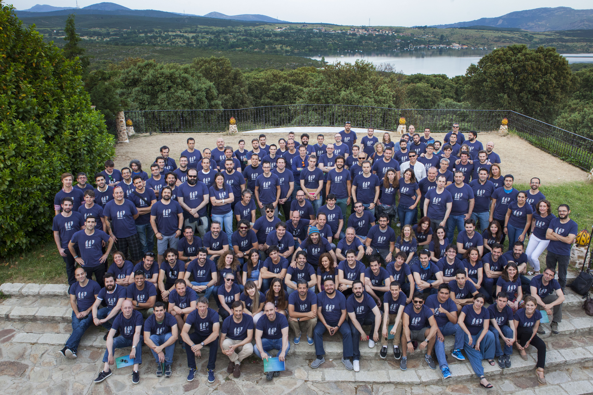

# Palako en Telefónica

## SW Arquitect & CTO en Eleven Paths (Abril 2013 - Mayo 2016)
Hola buddy, en esta [pull request](https://github.com/javi-jamaa/palako/pull/8) están recogidos los agradecimientos de todas las personas que han querido dejar constancia de cómo has impactado en sus vidas. You rocks!!
### 2013
* En Abril de 2013 te uniste desde Londres a Chema en su nueva aventura, Eleven Paths, siendo uno de sus primeros empleados. "¿Qué puede salir mal, Palako?" 

* Esta fue la primera Feature que creaste (26 de Julio) y la primera de todo Redmine, herramienta que trajiste tú!!!

* y estos serían tus primeros commits (Como te gustaba el Gerrit...)

* En Octubre montaste un KickOff en Londres para dar forma a Path2, todo empezaba a tener "muy buena pinta"

* En Diciembre tiene lugar el primer "Security Innovation Day" donde el plato fuerte fue la presentacion de **Latch**. (Codename: Path2). Te encargaste de contar todas las tripas del proyecto y como se integraba con sólo 5 lineas de código.

* Poco despues ya empezabas a dejar huella en otros proyectos. Justo después del SID Chema le pidió al equipo de **FirefoxOS** (vía Carlos Domingo) un ingeniero durante 1-2 días (tirando por lo alto 🤟) porque se quería hacer una versión de Latch para FirefoxOS. Se tardó un poquito más y al final fue algo más que un ingeniero (por ambos equipos) pero 2 meses después Latch estaba funcionando en FirefoxOS, ¡justo a tiempo para el MWC!

* Un tiempo más tarde compartiste con nosotros el secreto para llegar en fechas a ese MWC 

* Para acabar el año tuvimos la fiesta de Ciberseguridad de Telefónica donde te tomaste la penúltima

* Tu primer año en Telefónica pero ya dejaste una huella en su historia!

### 2014
* Dejaste boquiabiertos 20 veces en 20 minutos a unas cuantas audiencias!

* Celebramos el 1er aniversario de 11P y aunque las tartas de otras sedes eran mejores la que tuvisteis en Londres no estuvo nada mal!

* Desde el principio tuviste claro que venias a cambiar Telefónica y no sera que no lo intentaste!

* Por segundo año tuivmos otro Security Innovation Day esta vez para presentar **Tacyt** (Codename: Path5), como ves la familia cada vez era más grande! 

* En ese mismo Security Innovation Day **SmartAccess** se une a Eleven Paths. Dos nuevas lineas de producto a tu cargo!

* Las navidades siempre han sido eventos muy señalados.... y no hay mejor Papa Noel que Rodol!!

### 2015

* A principio de año **Mobile Connect** se unió a la familia, y ahí sigue siendo clave en la autenticación de muchos servicios!!!

* Como ya era tradición volvió el SID. Ese año te toco presentar, pero sin duda lo hiciste en la mejor compañia! 

* De tu mano nació el [**Equinox**](https://www.youtube.com/watch?v=8CEefqaI-9w) y con él la camiseta mas deseada del mundo!! Este fue uno de los primeros equipos que ganó y seguramente de los proyectos más impresionantes que hayas visto

* Seguro que recuerdas el "Calendillo" y los *martes*. Tus visitas a Madrid siempre eran un evento importante

* Ya el 2015 haciendo [retrospectiva](https://www.youtube.com/watch?v=upcvJfrfiHA) se veía que eramos una locomotora imparable!!

## CTO en CDO & CDCO (Junio 2016 - Abril 2021)
### 2016

* Chema se convirtió en el CDO de TEF y tu seguiste como CTO preparando el germen del resto de areas que llegarían. En aquel momento 11P ya era un equipo inmenso:

* Creaste los incunables del diseño de la **4P** y para hacerlo posible todos los cracks de la unidad del TDAF de Telefonica I+D se unieron a CTO

* Como no todo iba a ser ciberseguridad, en Junio de 2016, te metiste de lleno en el mundo del big data a través del equipo técnico de Analytics, rebranded as **LUCA**.

* Creamos la unidad de componentes transversales.

* Security Innovation Days, MWCs, ... y ya solo le faltaba para completar el trío presentar en el gran evento mundial del Big Data, el **Bigdata CyL**, finalmente tras arduas negociaciones con la organización que involucraron algún lechazo y un número indeterminado de copas de vino de la tierra se animo a dar la keynote del evento:

* Siempre has demostrado que se te da bien construir, ya sea software o estructuras más complejas

* Tu siempre has estado en Londres y por alli han ido pasando compañer@s a lo largo de los años que seguro que no olvidan esos momentos contigo

* Hiciste el primer offsite de CTO en Universitas, tu ibas en avión pero los que iban en tren desde Madrid se lo pasaron mejor :P

### 2017
* Lanzamos el primer plan tecnológico de la unidad, sin node.js unfortunately ;-)

* Lanzamos **Aura** y 4P en 6 paises en 6 meses rompiendo todo los records de Telefonica!!

* Arranca **SmartWifi 2.0**!

* En el off-site de 11P tocaste con tu grupo de rock (y con otra panda...) dejando alguna actuación histórica 

* Y en el Kick-Off de Aura demostraste tus dotes de interpretación e improvisación (más allá del desarrollo software 😃)

### 2018
* Fuiste al F8 de Facebook a dar una charla sobre Aura en Facebook Messenger.  

* En Octubre, tras 7 meses de locura, vio la luz **Movistar Home** en un evento con Buenafuente en el plató de su programa de TV

### 2019
* Diste forma a un nuevo producto: **Las Living Apps**!

* Este año llevaste el Equinox *to the next level*. Tres unidades de Telefónica juntas en la hackaton más grande que se recuerda

* Meses después, Novum se unió a la familia CTO!!

* Tu preocupación por la privacidad de los datos es legendaria y multicanal!!

* Todo el mundo sabe que eres tan fan de la tecnología como del deporte, así que para cerrar el año 2019 como dios manda, carreraca guapa de montaña en Cercedilla los días previos a la Navidad de 2019. Eras el jefe, así que hubo que bajar el ritmo para dejarte ganar... ;)

* Lanzamos el primer plan de carrera de CTO

### 2020
* En 2020 seguro que echaste de menos no tener Slack en el plan tecnológico... Teams dia sí, día también!

* A pesar de estar en medio de una pandemia todos los proyectos siguieron creciendo, entre otros, lanzamos muchas Living Apps: **Movistar Campus**, **Shop TV**, **Fortnite**...

### 2021
* Lanzamos una nueva versión actualizada del tech plan de CTO, todo en orden: seguimos sin tener node.js ;-)

* Tuviste tu último *all-hands* con tu unidad, donde dejaste muy claro tu misión y objetivos para este 2021

* Dejas como testamento para el nuevo CTO el Growth Ladder Plan!!!

* En abril Telefónica ha cumplido 97 años, tu has formado parte de ella los últimos 8 ayudando a convertirla en una empresa más tecnológica, de mejor software y de mejor calidad. Gracias por tu dedicación, tu entrega y la pasión que has puesto todo este tiempo en todos los proyectos y productos. Esto es parte de tu legado:

* Jose Maria Palazón (Palako) sirvió con honores y deber en Telefónica desde Abril del 2013 a Abril del 2021.

