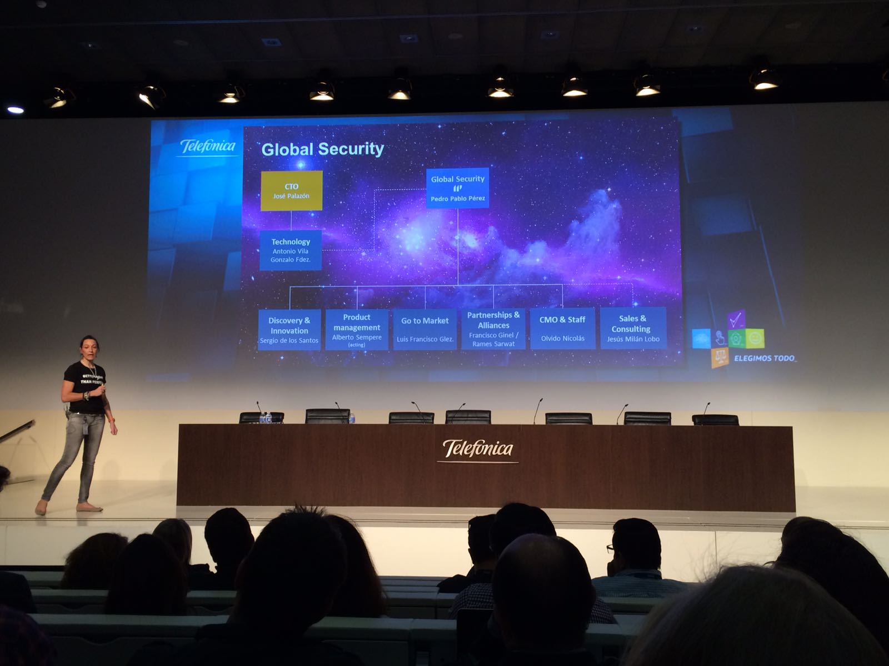

# Palako en Telefónica

Jose recogemos en este readme algunos de tus hitos más importantes en Telefónica, eventos que nos han ayudado a que gracias a tu esfuerzo y compromiso seamos un poco mejores que hace 8 años. 

## CTO en Eleven Paths (Abril 2013 - Mayo 2016)
### 2013
* Palako te uniste con Chema para crear Eleven Paths siendo su primer empleado. "쯈ué puede salir mal, Palako?" 

* Esta fue la primera Feature que creaste (26 de Julio) y la primera de todo Redmine!!!

* y estos serían tus primeros commits (Como te gustaba el Gerrit...)

* En Octubre montaste un KickOff en Londres para dar forma a Path2

* En Diciembre tiene lugar el primer "Security Innovation Day" donde el plato fuerte fue la presentacion de Latch. (Codename: Path2)
* Terminaste el año en la fiesta de Ciberseguridad de Telefónica tomando la penúltima

* Diciembre de 2013 y ya empezabas a dejar huella en otros proyectos. A principios de diciembre Chema le pidió al equipo de FirefoxOS (vía Carlos Domingo) un ingeniero durante 1-2 días (tirando por lo alto 🤟) porque se quería hacer una versión de Latch para FirefoxOS. Se tardó un poquito más y al final fue algo más que un ingeniero (por ambos equipos) pero 2 meses después Latch estaba funcionando en FirefoxOS, ¡justo a tiempo para el MWC!

* Siempre les ha gustado inventar cosas!!

### 2014
* Dejaste boquiabiertos 20 veces en 20 minutos a unas cuantas audiencias!

* Celebramos el 1er aniversario de 11P y aunque las tartas de otras sedes eran mejores la que tuvisteis en Londres no estuvo nada mal!

* Desde el principio tuviste claro que venias a cambiar Telefónica y no sera que no lo intentaste!

* Otro Security Innovation Day para presentar Path5 (Tacyt), la familia cada vez era más grande! 

* En ese mismo Security Innovation Day SmartAccess se une a Eleven Paths. Dos nuevas lineas de producto a su cargo!

* Las navidades siempre han sido eventos muy señalados.... y no hay mejor Papa Noel que Rodol!!

### 2015
* Este año en el SID te toco presentar, pero sin duda, tuviste buena compañia!

* Nace el Equinox y con él la camiseta mas deseada del mundo!!
* Se Lanza Mobile Connect que ahí sigue siendo clave en la autenticación de muchos servicios!!!

## CTO en CDO & CDCO (Junio 2016 - Abril 2021)
### 2016

* CTO de CDO, preparando el germen del resto de areas que llegarán

* Palako crea los incunables del diseño de la 4P!

* No todo iba a ser cyberseguridad, en Junio de 2016, se mete de lleno en el mundo del big data a través del equipo técnico de Analytics, rebranded as LUCA.
* La unidad del TDAF de Telefonica I+D se une a CTO para crear 4P
* Creamos la unidad de componentes transversales.
* Security Innovation Days, MWCs, ... y ya solo le faltaba para completar el trío presentar en el gran evento mundial del Big Data, el Bigdata CyL, finalmente tras arduas negociaciones con la organización que involucraron algún lechazo y un número indeterminado de copas de vino de la tierra se animo a dar la keynote del evento:

### 2017
* Lanzamos el primer plan tecnológico de la unidad, sin node.js unfortunately ;-)
* Lanzamos Aura y 4P en 6 paises en 6 meses rompiendo todo los records de Telefonica!!

* Arranca SmartWifi 2.0!

* En el off-site de 11P tocaste con tu grupo de rock (y con otra panda...) dejando alguna actuación histórica 

* Y en el Kick-Off de Aura demostraste tus dotes de interpretación e improvisación (más allá del desarrollo software 😃)

### 2018
* Se asiste al F8 de Facebook a dar una charla sobre Aura en Facebook Messenger.  

 
### 2019
* Este año llevaste el Equinox *to the next level*. Tres unidades de Telefónica juntas en la hackaton más grande que se recuerda

* Novum se une a la familia CTO!!

* Una reorga en TEF dio lugar al último comité de CDO

* Su preocupación por la privacidad de los datos es legendaria y multicanal!!

* Todo el mundo sabe que eres tan fan de la tecnología como del deporte, así que para cerrar el año 2019 como dios manda, carreraca guapa de montaña en Cercedilla los días previos a la Navidad de 2019. Eras el jefe, así que hubo que bajar el ritmo para dejarte ganar... ;)

* Lanzamos el primer plan de carrera de CTO

### 2020
* En 2020 seguro que echaste de menos no tener Slack en el plan tecnológico... Teams dia sí, día también!

### 2021
* Se lanza una nueva versión del tech plan de CTO, seguimos sin tener node.js ;-)
* Se deja como testamento para el nuevo CTO el Growth Ladder Plan!!!

* En abril Telefónica ha cumplido 97 años, tu has formado parte los últimos 8 ayudando a convertirla en una empresa más tecnológica, de mejor software y de mejor calidad. Esto es parte de tu legado:

